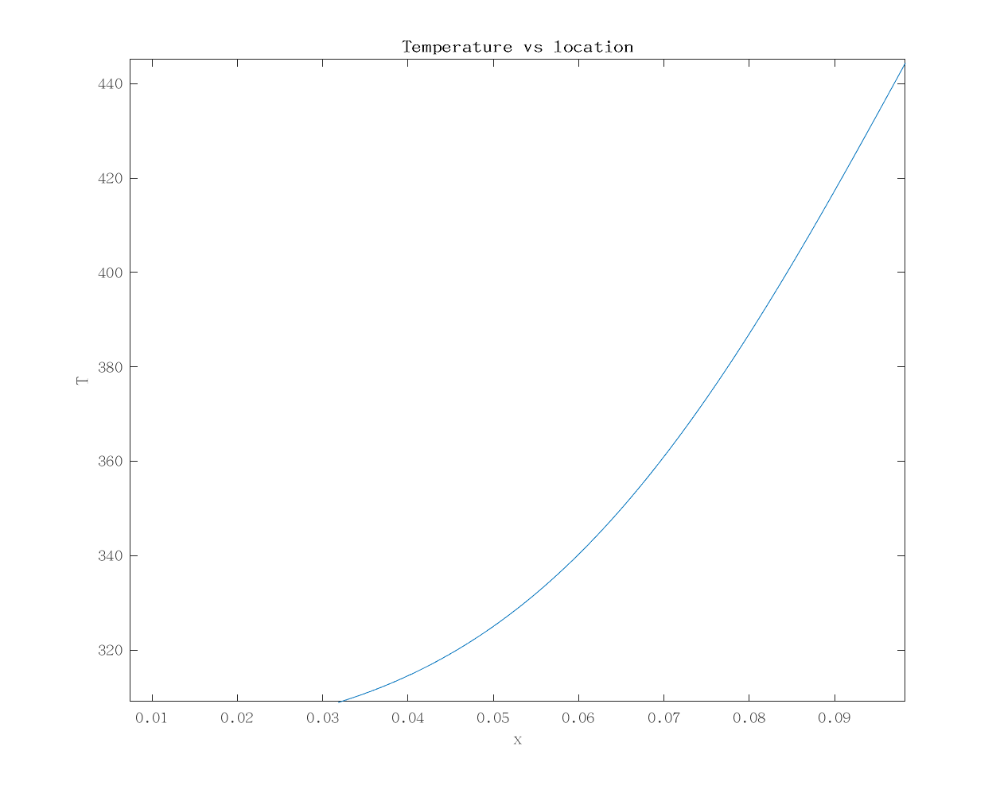

# 1D Heat Transfer (Diffusion) simulation

Compile this code using:

```
gcc 1D_Heat_Transfer_Simulation_in_Air.c -o 1D_Heat_Transfer_Simulation_in_Air.exe
```

This will make a new file (results.txt). To view in MATLAB:

```
data = load('results.txt')
plot(data(:,1), data(:,2))
xlabel('x')
ylabel('T')
title('Temperature vs location')
saveas(gcf, 'Result.png')
```


