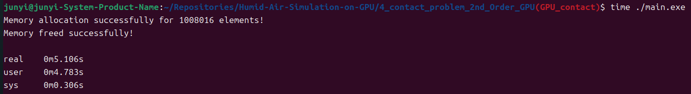
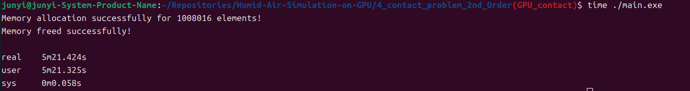

This program is a Finite Volume Method (FVM) solver for 2D Euler equations. 

This program use CUDA to speed up the 2nd-Order Exact Riemann Solver and solve the 4-contact-problem.

Initial condition:
```
Region A (Quadrant I):
0.5 <= x <= 1, 0.5 <= y <= 1.
Density = 1.0
u = X-direction velocity = 0.75
v = Y-direction veloctiy = -0.5
P = Pressure = 1.0

Region B (Quadrant II):
0 <= x < 0.5, 0.5 <= y <= 1.
Density = 2.0
u = X-direction velocity = 0.75
v = Y-direction veloctiy = 0.5
P = Pressure = 1.0

Region C (Quadrant III):
0 <= x < 0.5, 0 <= y < 0.5.
Density = 1.0
u = X-direction velocity = -0.75
v = Y-direction veloctiy = 0.5
P = Pressure = 1.0

Region D (Quadrant IV):
0.5 <= x <= 1, 0 <= y < 0.5.
Density = 3.0
u = X-direction velocity = -0.75
v = Y-direction veloctiy = -0.5
P = Pressure = 1.0

Ratio of specific heats = 1.4, R = 1, L = 1m. Computed time = 0.2s.
```

compile this code using :
```
COMPLIER := gcc
OPT_FLAGS := -O3 -lm
all:
	${COMPLIER} main.c memory.c Calc_rho_u_P_T.c Boundary.c ${OPT_FLAGS} -o main.exe
```

Final result of density:

Density vs location:


GPU time:


CPU time:


Speed up: (5 * 60 + 21.424) / 5.106 = 62.950
