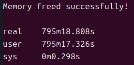
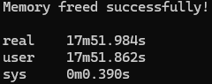

This program simulates a boiling water problem within a 1.0 m × 0.5 m rectangular domain.
A heated patch is designated along the bottom wall between x = 0.2 m and 0.7 m (T = 100 C, with the mass fraction set to its maximum value).
At the left boundary, a velocity profile with a peak of U_max = 5 m/s continuously injects flow into the domain, while the top and right boundaries are modeled as open boundaries.

In this program, the gas constant (R) and constant-volume specific heat capacity (Cv) are not treated as constants;
instead, they are evaluated based on a binary gas mixture of dry air and H2O.
Specifically, the values of Cv for dry air and water vapor are computed using the NASA polynomial formulations and their corresponding coefficient datasets.
(http://combustion.berkeley.edu/gri-mech/data/nasa_plnm.html)

Additionally, I used the Newton–Raphson method to iteratively obtain more precise temperature values.

The final results will present the full flow-field contours of x-direction velocity, temperature, mass fraction, and relative humidity at t = 1s, 2s, and 3s of physical simulation time.

This program provides an effective means to verify and validate the accuracy of the mass fraction calculations

Due to the excessive computation time required by the CPU implementation, the solver was ported to CUDA for GPU parallel computing to accelerate execution.

```
Initial condition:
u = X-direction velocity = 5 m/s (everywhere), v = Y-direction veloctiy = 0m/s (everywhere)
T = temperature = 300.15 K (everywhere)
P = 1 atm (everywhere), phi = Mass fraction = 0 (everywhere)

```

compile this code using makefile
```
all: GPU CPU
	nvcc main.o memory.o Initial.o Calc_flux.o Primitive_variable.o compute_T.o Compute_Cv.o Boundary.o -code=sm_89 -arch=compute_89 -o main.exe
GPU:
	nvcc memory.cu Initial.cu Calc_flux.cu Primitive_variable.cu compute_T.cu Compute_Cv.cu Boundary.cu -dc -code=sm_89 -arch=compute_89
CPU:
	g++ main.c -c
clean:
	rm *.o
 ```


Final results for X-dir Veloctiy, Temperature, Mass fraction, Relative Humidity:

X-direction Velocity vs Location:


Temperature vs Location:


Mass fraction vs Location:


Relative Humidity vs Location:


As observed, the results at t = 1s, 2s, and 3s exhibit negligible variations, indicating that the simulation has already achieved a steady state by t = 1s.

CPU time:


GPU time:


The GPU parallel implementation achieves a speedup factor of (795 * 60 + 18.808) / (17 * 60 + 51.984) = 44.51 over the single-core CPU execution, representing an acceleration of nearly 45×.
