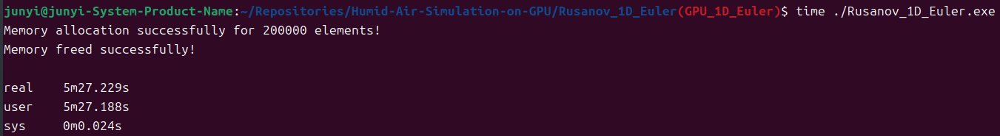
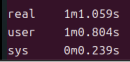

The purpose of this program is to simulate a 1D Euler Equation problem using the Rusanov method and compare the speed with use 1x CPU core and use CUDA.
Use 200,000 cells result to see speedup.

Initial condition:
```
u = velocity = 0 m/s (everywhere),   T = temperature = 1 K (everywhere)

Density = 10m  (x < 0.5L)
           1m  (x >= 0.5L)

Ratio of specific heats = 1.4, R = 1, L = 1m. Computed time = 0.2s.
```

compile this code using makefile :
```
all: GPU CPU
	nvcc main.o memory.o Initial.o GPU_calc_flux.o Calc_conserved.o Calc_variable.o Boundary.o -code=sm_89 -arch=compute_89 -o main.exe
GPU:
	nvcc memory.cu GPU_calc_flux.cu Calc_conserved.cu Calc_variable.cu Boundary.cu -c -code=sm_89 -arch=compute_89
CPU:
	g++ main.c Initial.c -c
clean:
	rm *.o main.exe
```

Final results for density, velocity, temperature, pressure. This is for ensure my cuda code didn't have bug.

Density of each cell:


Velocity of each cell:


Temperature of each cell:


Pressure of each cell:


Speedup time:



The speedup is 5.3592.
